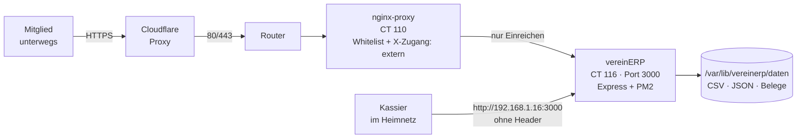

# Architektur – vereinERP

Stand: Oktober 2026 (v1.0.0)

## Überblick

vereinERP ist eine Browser-Anwendung ohne Build-Schritt: reines HTML, CSS und
JavaScript, das direkt so ausgeliefert wird, wie es im Repo liegt. Dazu kommt
ein optionales Node.js-Backend in `server/`. Es gibt keine Datenbank – alle
Daten sind Dateien (CSV, JSON, Belege), die auch ohne die App lesbar bleiben.

Die App läuft in **zwei Modi** mit identischem Datenformat ([Spec 001](specs/001-speichermodi.md)):

| | Ordner-Modus | Server-Modus |
|---|---|---|
| Start | `vereinERP.html` lokal öffnen | vom Backend ausgeliefert |
| Daten | lokaler Ordner (File System Access API) | `DATEN_DIR` auf dem Server |
| Browser | nur Edge / Chrome | alle, auch Handy |
| Anmeldung | keine | Benutzername + Passwort, Rollen |
| Eingang (Rechnungen von Mitgliedern) | – | ja |

Welcher Modus aktiv ist, entscheidet die App beim Start selbst: antwortet
`/api/status` mit `server: true`, läuft sie im Server-Modus, sonst lokal.

## Produktivbetrieb



- **Öffentlich:** `https://kasse.schmalzpicker.ch` – Cloudflare, dann der
  Reverse-Proxy (`nginx-proxy`), dann die App. Von aussen kommt nur die
  Einreichen-Seite durch ([Spec 004](specs/004-einreichen-seite.md)).
- **Intern:** `http://192.168.1.16:3000` – direkt auf den Container, an
  Cloudflare und Proxy vorbei. Volle App für den Kassier.
- Infrastruktur (Container, nginx, DNS, Deployment) liegt im separaten Repo
  `server-setup` – Terraform und Ansible.

## Sicherheit in Schichten

Das zentrale Prinzip: **was jemand darf, entscheidet zuerst der Weg, dann die
Rolle.** Jede Sperre existiert mindestens zweimal, damit ein Fehler an einer
Stelle nicht reicht ([Spec 002](specs/002-zugangsmodell.md)).

| Schicht | Wo | Was sie tut |
|---|---|---|
| 1. Pfad-Whitelist | nginx, `kasse.schmalzpicker.ch.conf` | nur die Einreichen-Seite und vier API-Endpunkte kommen durch, alles andere 404 |
| 2. Zugangsweg | App, `nurIntern()` + statische Whitelist | nginx setzt `X-Zugang: extern`; die App sperrt damit dieselben Pfade selbst noch einmal |
| 3. Rolle | App, `requireKassier()` | auch intern sieht ein Mitglied kein Kassenbuch |
| 4. Eingabe | App, `hilfen.js` | Endungs-Whitelist, 10 MB, Path-Traversal-Guard, Namen aus der Session statt aus dem Formular |

Den Header `X-Zugang` kann ein Client nicht fälschen: nginx setzt ihn mit
`proxy_set_header` und überschreibt dabei, was mitgeschickt wurde. Wer den
Proxy umgeht, sitzt bereits im Heimnetz.

Weitere Massnahmen: bcrypt-Passwörter (Kosten 12), Sessions im Dateisystem
(überleben Neustarts), Login-Rate-Limit in App (10/15 min) und nginx
(5/min), echte Client-IP über `CF-Connecting-IP`, Secure-Cookies hinter HTTPS
(`secure: "auto"`, damit der interne HTTP-Zugang funktioniert).

## Komponenten

### Frontend (`js/`, keine Module, globale Funktionen)

| Datei | Aufgabe |
|---|---|
| `basis.js` | Konstanten (Kategorien, Steuercodes, Konten, CSV-Spalten), Zustand, Hilfsfunktionen, CSV parsen/schreiben |
| `speicher.js` | Dateizugriff Ordner-Modus; zweigt im Server-Modus nach `speicher-server.js` ab |
| `speicher-server.js` | Dateizugriff Server-Modus über `/api/…`, ETag-Konfliktschutz |
| `anmeldung.js` | Login, Rollen, Oberfläche je Zugangsweg |
| `wiederkehrend.js` | Vorlagen für wiederkehrende Buchungen, Belegablage |
| `eingang.js` | Rechnungseingang in der App (Liste, Übernehmen, Löschen) |
| `verlauf.js` | Chart des Kontostand-Verlaufs |
| `app.js` | Formular, Liste, Kontostand, Jahresrechnung, Steuer, Tabs, Moduswahl beim Start |
| `einreichen.js` | **eigenständig** – Logik der öffentlichen Einreichen-Seite, lädt keine der anderen Dateien |

Die Skripte werden in fester Reihenfolge per `<script>` geladen
(`vereinERP.html`); spätere Dateien verwenden Funktionen der früheren.

### Backend (`server/`)

| Datei | Aufgabe |
|---|---|
| `index.js` | Startpunkt (PM2), nur `listen()` |
| `app.js` | Express-App: Middleware, Router, statische Auslieferung, externe Whitelist |
| `auth.js` | Sessions, Login/Logout, `/api/status`, `requireAuth`, `requireKassier` |
| `daten.js` | `/api/kassenbuch` (CSV als Bytefolge, ETag/If-Match), `/api/einstellungen` |
| `belege.js` | Belegablage `Belege/<Jahr>/` |
| `eingang.js` | Rechnungseingang |
| `hilfen.js` | `DATEN_DIR`, Dateinamen, Path-Traversal-Guard, `istExtern`, `nurIntern` |
| `version.js` | Version aus `git describe` (Release-Tag, alpha dazwischen) für `/api/version` |
| `benutzer-cli.js` | Benutzerverwaltung auf der Kommandozeile |
| `test/` | Tests mit `node:test` gegen ein temporäres Datenverzeichnis |

## Datenformat

```
DATEN_DIR/
├── kassenbuch.csv        Buchungen · Semikolon · UTF-8 mit BOM (Excel)
├── einstellungen.json    Vereinsname, Freigrenze, Konten pro Jahr, Vorlagen
├── eingang.json          eingereichte Rechnungen (nur Server-Modus)
├── benutzer.json         Benutzer mit bcrypt-Hash und Rolle (nur Server-Modus)
├── .session-geheimnis    Session-Secret (nur Server-Modus)
├── .sitzungen/           Sessions (nur Server-Modus)
├── Belege/<Jahr>/        abgelegte Belege
└── Eingang/              hochgeladene, noch nicht übernommene Rechnungen
```

**CSV-Spalten** (`CSV_HEADER` in `js/basis.js`, Reihenfolge ist Teil des Formats):
`ID; Datum; Jahr; Typ; Kategorie; Steuercode; Beschreibung; Von_An; Betrag_CHF; Konto; Belege; Notizen; Status; VorlageID`

- `Typ`: `E` Einnahme · `A` Ausgabe
- `Status`: `OK` bestätigt · `GEPLANT` noch nicht bezahlt/eingegangen
- `Belege`: relative Pfade, mit `|` getrennt, z. B. `Belege/2026/260712_…pdf`

Der Server behandelt die CSV als **opake Bytefolge** (`express.raw`): ein
Text-Parser würde das BOM entfernen und Excel bräche bei den Umlauten.

## Entscheidungen

Die Begründungen der wichtigsten Weichenstellungen stehen in
[specs/adr.md](specs/adr.md).
